# 🐾 PetShop Web Application

A full-stack web application designed for managing and browsing pet products with real-time updates and admin control. Built with the MERN stack and MySQL for dynamic data handling.

---

## 📌 Features

- 🐶 **Pet Product Listings:** View a wide variety of pet essentials.
- 📦 **CRUD Operations:** Admin can add, edit, view, and delete products.
- 🛒 **User-Friendly Interface:** Clean UI for both customers and admins.
- 🔐 **Admin Authentication:** Secure login to access the admin dashboard.
- 📊 **MySQL Integration:** Stores all product data securely.
- 🔄 **Real-Time Updates:** Changes reflect instantly using Redux or Context API.

---

## 🛠️ Tech Stack

- **Frontend:** React.js
- **Backend:** Node.js, Express.js
- **Database:** MySQL
- **State Management:** Redux
- **Authentication:** JWT

---

## 📷 Screenshots

## Registration Page    &     Login Page                                                     

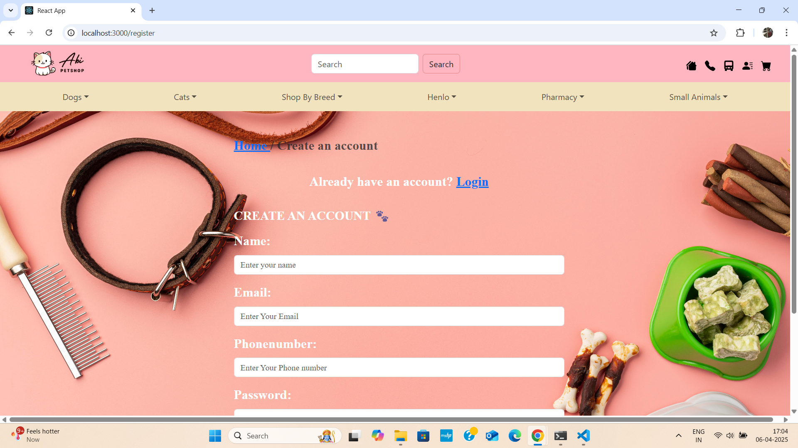  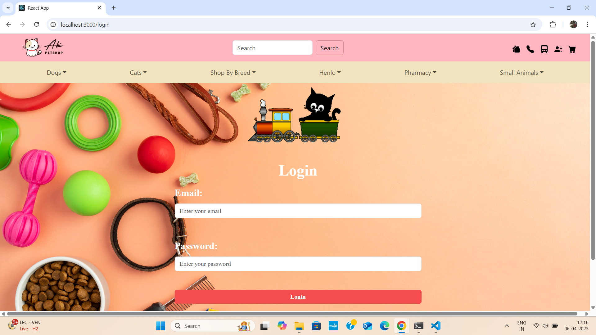 
                                                                               

## Home Page           &      Toys Page

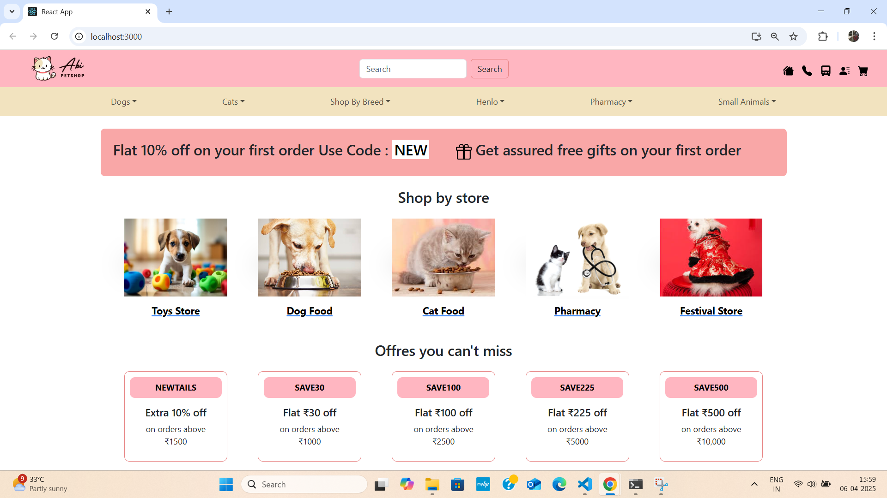    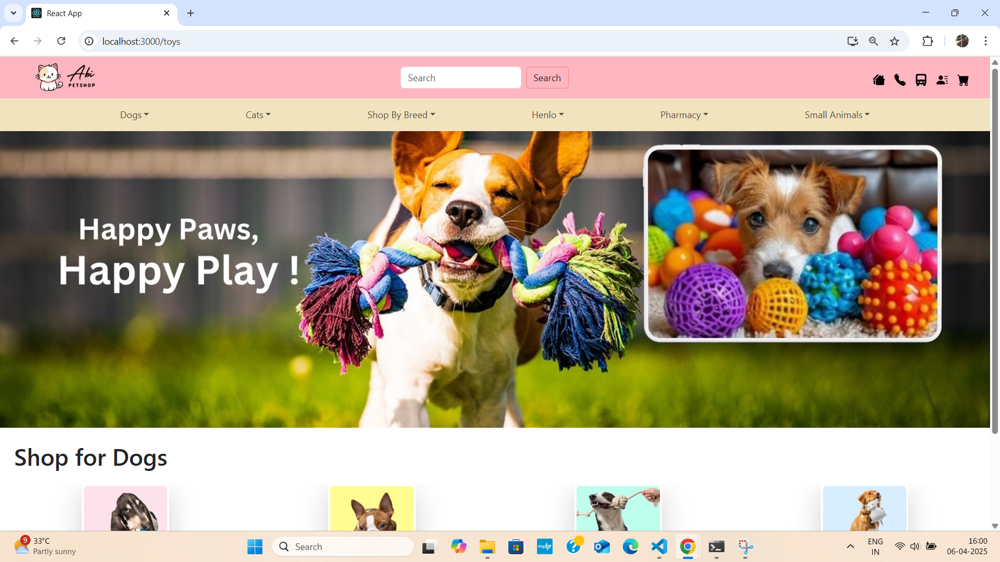

## Product Page

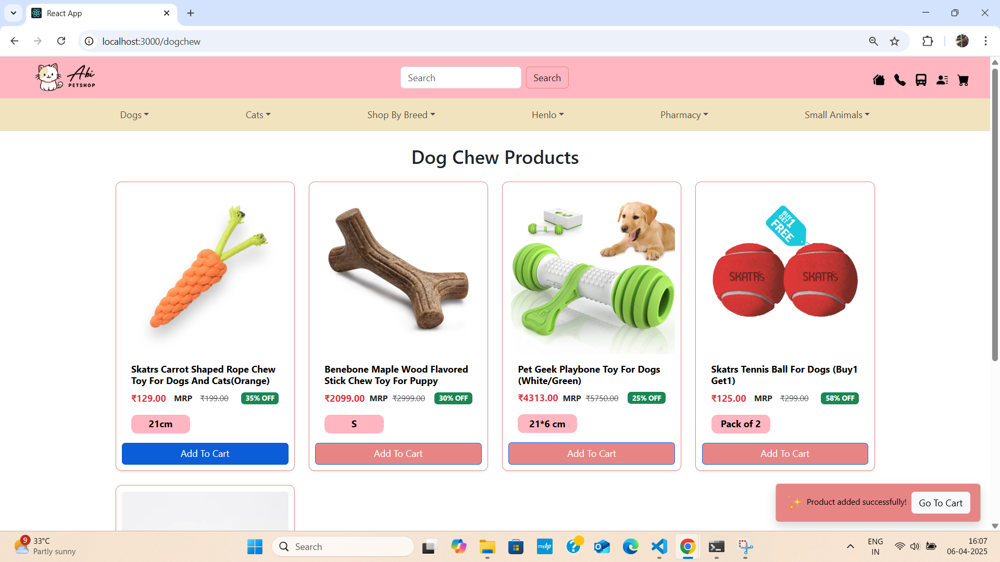 
                                                                               

## Checkout Page           &      PlaceOrder Page

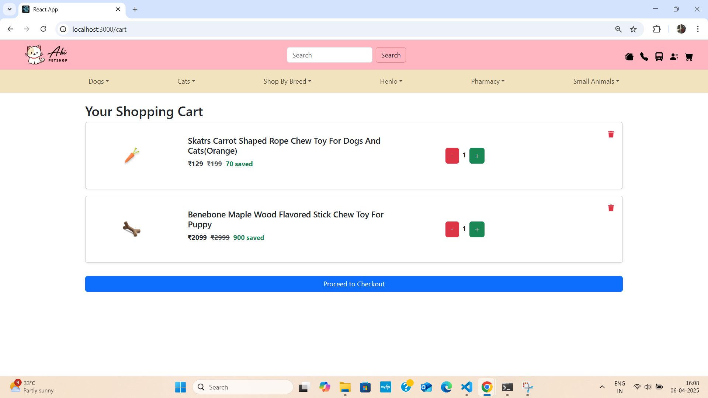  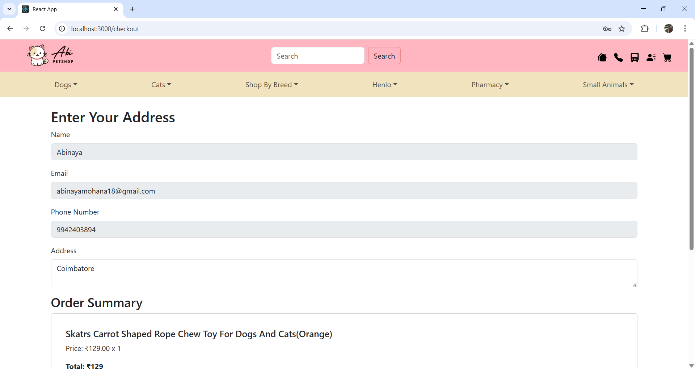 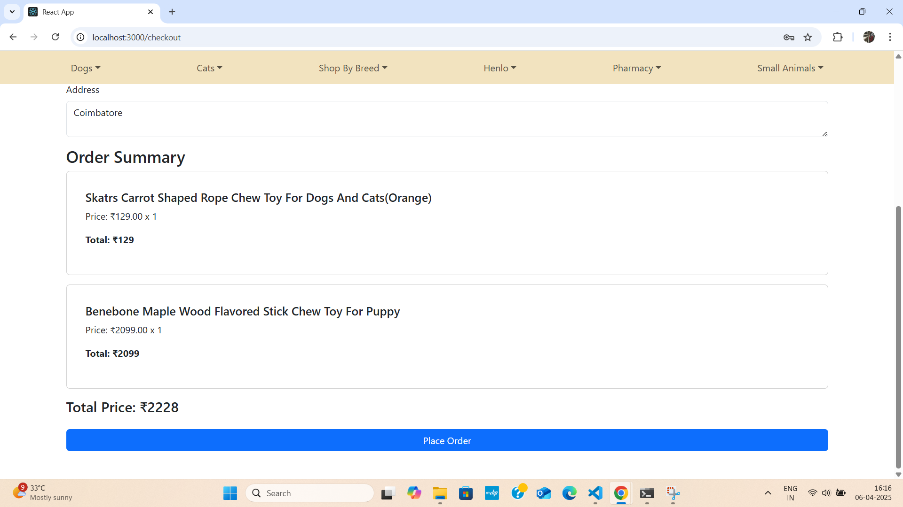
                                                                               

## Order details Page           &      Address details Page

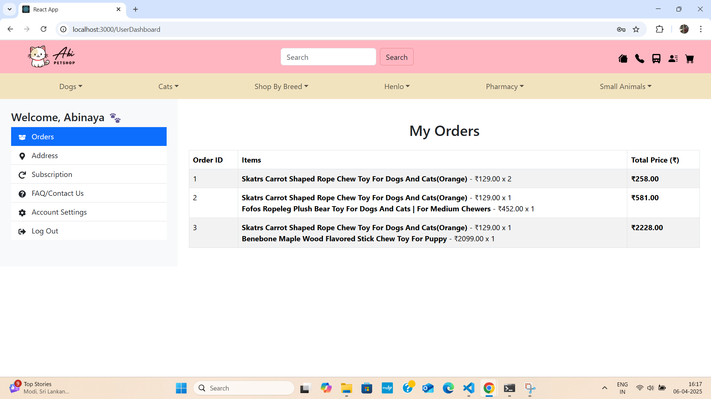   
                                                                               

## Contact Us Page           &      Account settings Page

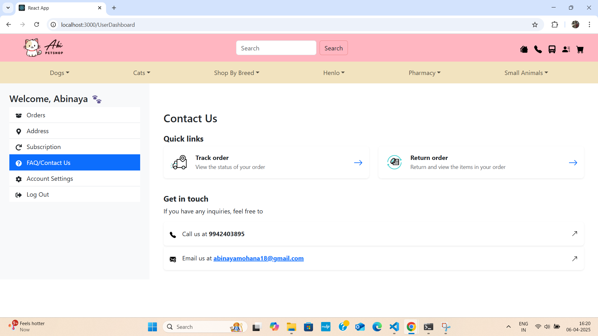  
                                                                               

## Track your orders Page       

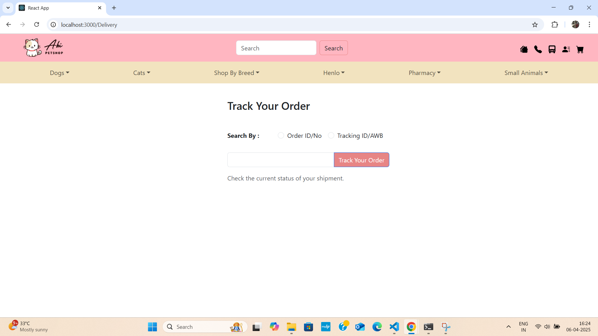  

## Responsive UI

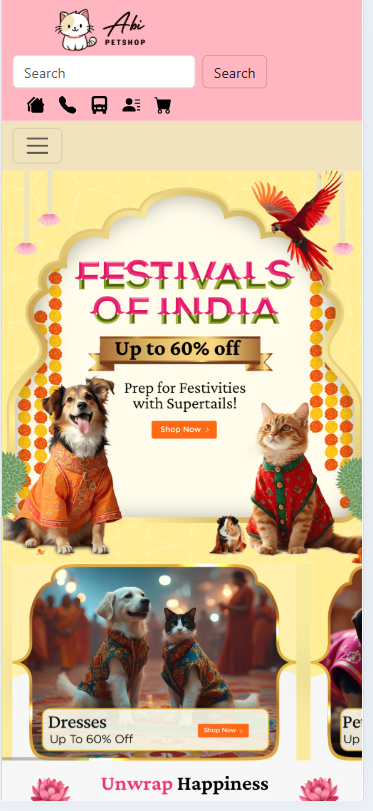  

---

## Admin pages

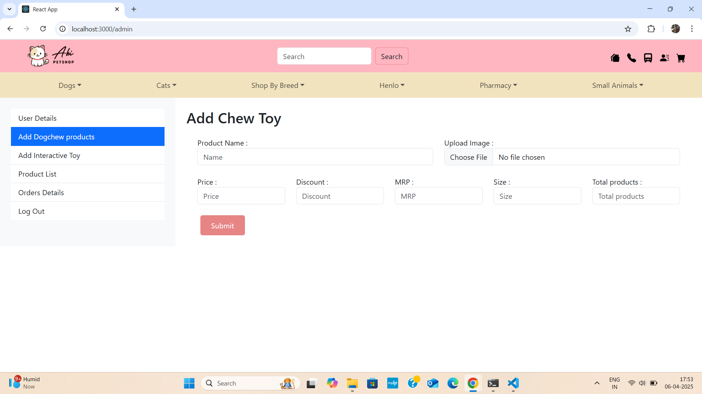   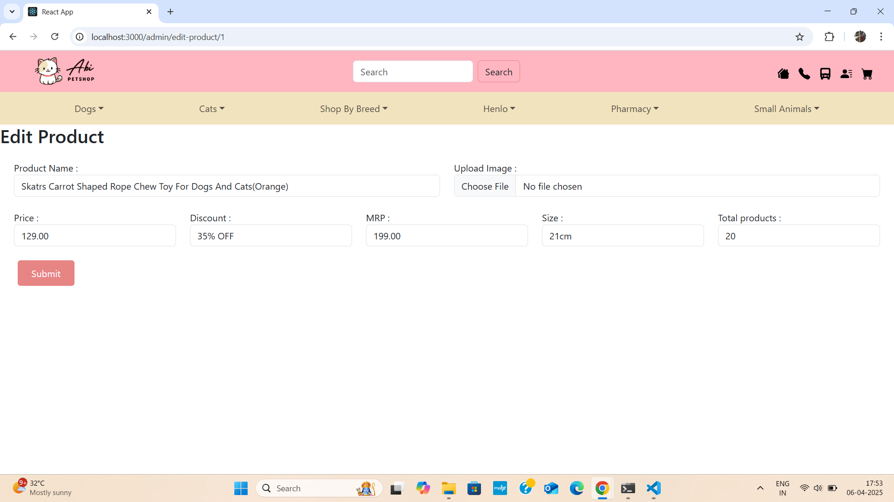 

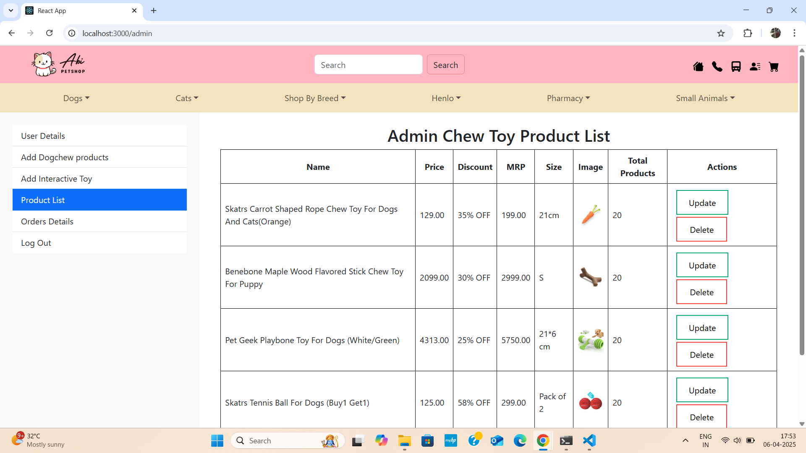   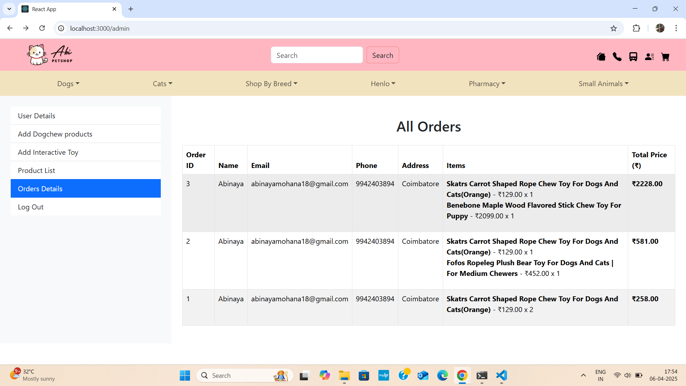 

---

✍️ Author
Abinayamohana – LinkedIn [https://www.linkedin.com/in/abinayamohana-r-272421212/](https://www.linkedin.com/in/abinayamohana/)

Passionate about building full-stack applications with clean UI and strong backend logic.

